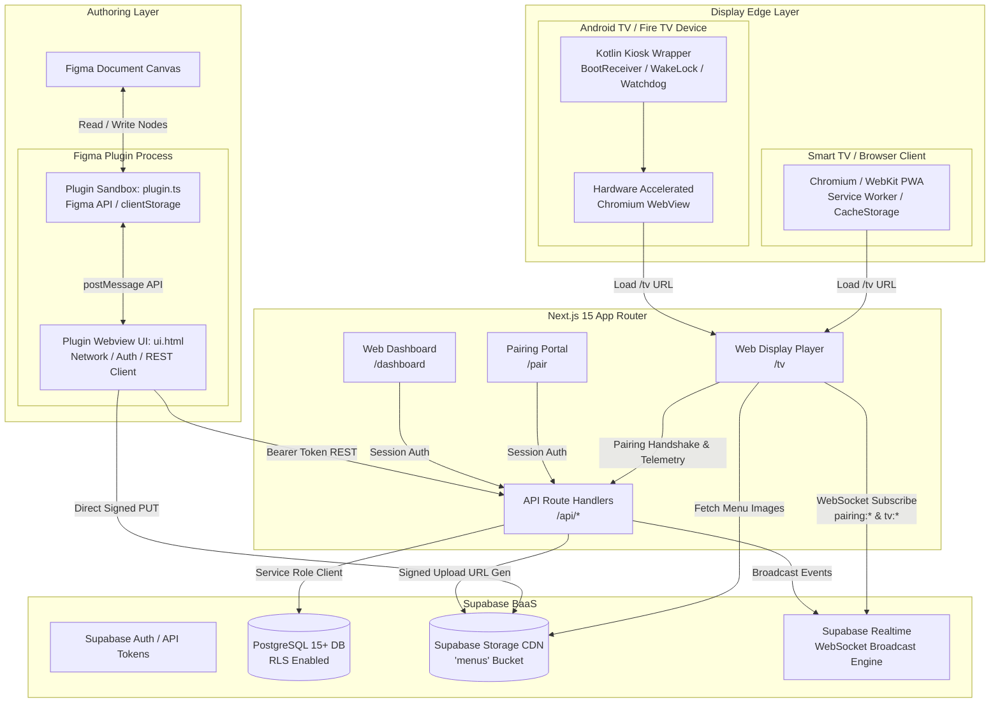
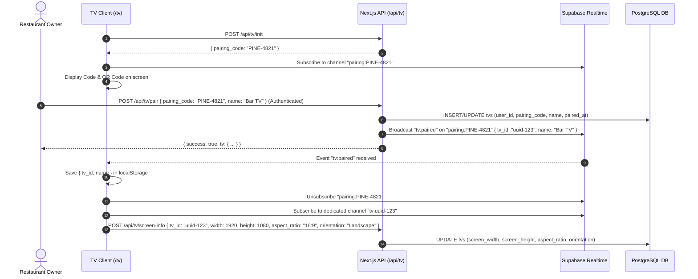
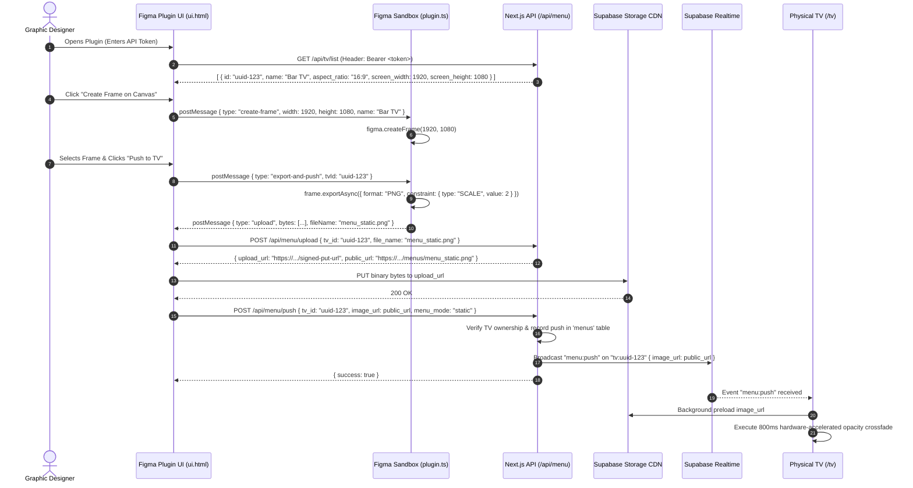
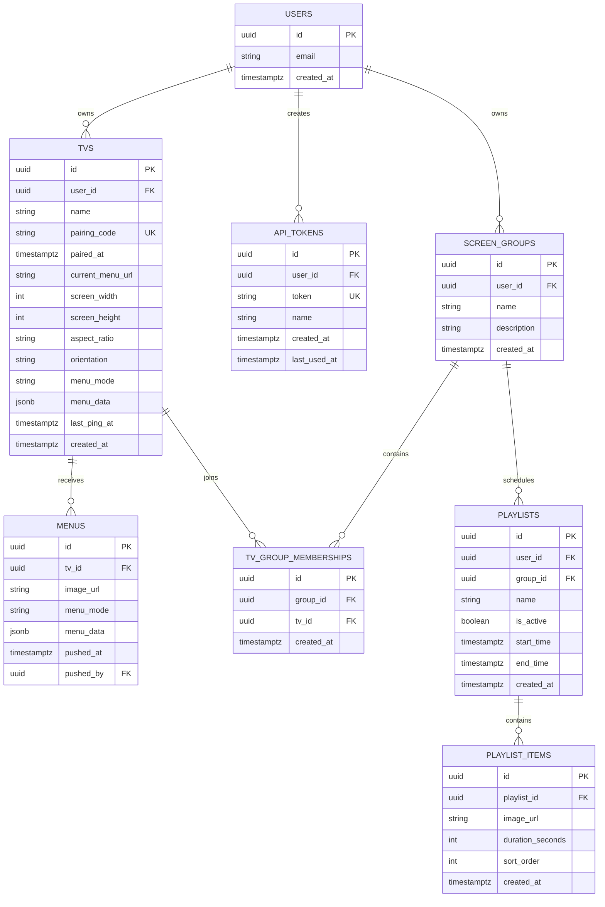

# Solution Architecture Document — MenuCast (miniKast)

**Document Status**: `Approved / Definitive`  
**Version**: `1.0.0`  
**System Architect**: BMad Technical Architect (`Winston`) / Antigravity  
**Target Release**: MVP $\rightarrow$ V1.0  
**Last Updated**: 2026-08-20  

---

## 1. System Architecture & Topology

MenuCast is engineered as a distributed real-time digital signage platform. The architecture separates **Authoring (Figma)**, **Fleet Management & Portal (Next.js Web)**, **Real-Time Orchestration & Persistence (Supabase Cloud)**, and **Hardware Edge Displays (Android TV / Web Player)**.



---

## 2. Component Deep Dive & Monorepo Structure

The monorepo uses `pnpm` workspaces with clear boundary separation:

```
menucast/
├── apps/
│   ├── web/               # Next.js 15 (App Router), React 19, TailwindCSS, Auth.js
│   ├── figma-plugin/      # Figma Plugin API v2 (Sandbox + UI iframe bundle)
│   └── tv-android/        # Native Kotlin Android TV / Amazon Fire TV Kiosk
├── packages/
│   └── supabase/          # Shared Database TypeScript interfaces & client factories
├── supabase/
│   └── migrations/        # Declarative SQL migrations with RLS policies
└── docs/                  # System documentation & PRD
```

### 2.1 Figma Plugin Subsystem (`apps/figma-plugin`)
- **Isolation Sandbox (`src/plugin.ts`)**:
  - Runs in Figma's sandboxed JavaScript VM.
  - Access to `figma` scene graph (`createFrame`, `resize`, `exportAsync`).
  - Access to `figma.clientStorage` for local token and server URL persistence.
  - **Zero Network/DOM Access**: Strictly communicates with UI thread via `figma.ui.postMessage` and `figma.ui.onmessage`.
- **UI Thread (`src/ui/index.html` bundled via `scripts/bundle-ui.js`)**:
  - Executes in an `<iframe>` inside the Figma desktop/web application.
  - Handles user interactions, REST API calls (`/api/tv/list`, `/api/menu/upload`, `/api/menu/push`), and binary image uploads.

### 2.2 Web Application & Edge Player (`apps/web`)
- **Server Runtime**: Next.js 15 App Router running Node.js / Edge runtimes.
- **Display Player (`/tv`)**:
  - Pure client-side React component optimized for low CPU/RAM smart TVs.
  - Double-buffered DOM image renderer (`TvImageCrossfade`) utilizing hardware-accelerated CSS GPU transitions (`opacity`, `will-change: opacity`).
  - Local state machine: `loading` $\rightarrow$ `pairing` $\rightarrow$ `paired` $\rightarrow$ `displaying`.
  - Offline fallback via `localStorage` device profile persistence and Service Worker caching.
- **Fleet Dashboard (`/dashboard`)**:
  - Screen management, instant manual file upload, screen grouping, and API token generation.

### 2.3 Android TV Kiosk Container (`apps/tv-android`)
- **Native Shell (`MainActivity.kt`, `BootReceiver.kt`)**:
  - Android SDK 34, AndroidX, ViewBinding.
  - Intercepts `ACTION_BOOT_COMPLETED` to launch automatically on power-up.
  - Sets `FLAG_KEEP_SCREEN_ON` on the window to prevent screensavers or sleep mode.
  - Network state watchdog (`ConnectivityManager.NetworkCallback`) triggering auto-recovery upon Wi-Fi reconnection.
  - Remote control key event interceptor (`KEYCODE_MENU`, `KEYCODE_MEDIA_PLAY_PAUSE`, `KEYCODE_R`, `KEYCODE_BACK`).
- **Embedded Web Engine**:
  - Hardware-accelerated Chromium WebView with `LOAD_DEFAULT` caching and WebContentsDebugging enabled for remote DevTools inspection.

### 2.4 Persistence & Realtime Layer (`supabase/`)
- **PostgreSQL Database**: Relational schema with Row Level Security (RLS) enforcing strict user isolation.
- **Supabase Realtime**: WebSocket broadcast cluster for low-latency pub/sub without database polling.
- **Supabase Storage**: CDN-backed S3-compatible object storage with public read policies for the `menus` bucket and signed PUT URLs for uploads.

---

## 3. Sequence Workflows & Interaction Protocols

### 3.1 Sequence 1: Screen Pairing Handshake


---

### 3.2 Sequence 2: Figma 1-Click Push Pipeline


---

## 4. Complete Database Schema & Relations



### 4.1 SQL Schema Definitions (Supabase PostgreSQL)

```sql
-- Enable PGCrypto for UUID & token generation
CREATE EXTENSION IF NOT EXISTS "pgcrypto";

-- 1. TVs Table
CREATE TABLE tvs (
  id UUID PRIMARY KEY DEFAULT gen_random_uuid(),
  user_id UUID NOT NULL REFERENCES auth.users(id) ON DELETE CASCADE,
  name TEXT NOT NULL DEFAULT 'My TV',
  pairing_code TEXT UNIQUE NOT NULL,
  paired_at TIMESTAMPTZ,
  current_menu_url TEXT,
  screen_width INT,
  screen_height INT,
  aspect_ratio TEXT,
  orientation TEXT,
  menu_mode TEXT DEFAULT 'static',
  menu_data JSONB DEFAULT NULL,
  last_ping_at TIMESTAMPTZ,
  created_at TIMESTAMPTZ DEFAULT now()
);

-- 2. Menus Push History
CREATE TABLE menus (
  id UUID PRIMARY KEY DEFAULT gen_random_uuid(),
  tv_id UUID NOT NULL REFERENCES tvs(id) ON DELETE CASCADE,
  image_url TEXT NOT NULL,
  menu_mode TEXT DEFAULT 'static',
  menu_data JSONB DEFAULT NULL,
  pushed_at TIMESTAMPTZ DEFAULT now(),
  pushed_by UUID REFERENCES auth.users(id)
);

-- 3. API Tokens for Figma Plugin
CREATE TABLE api_tokens (
  id UUID PRIMARY KEY DEFAULT gen_random_uuid(),
  user_id UUID NOT NULL REFERENCES auth.users(id) ON DELETE CASCADE,
  token TEXT UNIQUE NOT NULL DEFAULT encode(gen_random_bytes(32), 'hex'),
  name TEXT NOT NULL DEFAULT 'Figma Plugin',
  created_at TIMESTAMPTZ DEFAULT now(),
  last_used_at TIMESTAMPTZ
);

-- 4. Screen Groups (Multi-Screen Management)
CREATE TABLE screen_groups (
  id UUID PRIMARY KEY DEFAULT gen_random_uuid(),
  user_id UUID NOT NULL REFERENCES auth.users(id) ON DELETE CASCADE,
  name TEXT NOT NULL,
  description TEXT,
  created_at TIMESTAMPTZ DEFAULT now()
);

-- 5. Screen Group Memberships
CREATE TABLE tv_group_memberships (
  id UUID PRIMARY KEY DEFAULT gen_random_uuid(),
  group_id UUID NOT NULL REFERENCES screen_groups(id) ON DELETE CASCADE,
  tv_id UUID NOT NULL REFERENCES tvs(id) ON DELETE CASCADE,
  created_at TIMESTAMPTZ DEFAULT now(),
  UNIQUE(group_id, tv_id)
);

-- RLS Declarations
ALTER TABLE tvs ENABLE ROW LEVEL SECURITY;
ALTER TABLE menus ENABLE ROW LEVEL SECURITY;
ALTER TABLE api_tokens ENABLE ROW LEVEL SECURITY;
ALTER TABLE screen_groups ENABLE ROW LEVEL SECURITY;
ALTER TABLE tv_group_memberships ENABLE ROW LEVEL SECURITY;

CREATE POLICY "Users own their TVs" ON tvs FOR ALL USING (auth.uid() = user_id) WITH CHECK (auth.uid() = user_id);
CREATE POLICY "Public TV lookup by pairing code" ON tvs FOR SELECT USING (true);
CREATE POLICY "Users see their TV menus" ON menus FOR ALL USING (tv_id IN (SELECT id FROM tvs WHERE user_id = auth.uid()));
CREATE POLICY "Users own their tokens" ON api_tokens FOR ALL USING (auth.uid() = user_id) WITH CHECK (auth.uid() = user_id);
CREATE POLICY "Users own their screen groups" ON screen_groups FOR ALL USING (auth.uid() = user_id) WITH CHECK (auth.uid() = user_id);
CREATE POLICY "Users manage their group memberships" ON tv_group_memberships FOR ALL USING (group_id IN (SELECT id FROM screen_groups WHERE user_id = auth.uid()));
```

---

## 5. API & WebSocket Specifications

### 5.1 REST API Contracts

#### `POST /api/tv/init`
- **Auth**: Public
- **Response**:
  ```json
  { "pairing_code": "PINE-4821" }
  ```

#### `POST /api/tv/pair`
- **Auth**: Session Cookie
- **Request**:
  ```json
  { "pairing_code": "PINE-4821", "tv_name": "Bar TV" }
  ```
- **Response**:
  ```json
  { "tv": { "id": "9b1deb4d-3b7d-4bad-9bdd-2b0d7b3dcb6d", "name": "Bar TV", "pairing_code": "PINE-4821" } }
  ```

#### `GET /api/tv/list`
- **Auth**: Bearer Token or Session Cookie
- **Response**:
  ```json
  {
    "tvs": [
      {
        "id": "9b1deb4d-3b7d-4bad-9bdd-2b0d7b3dcb6d",
        "name": "Bar TV",
        "pairing_code": "PINE-4821",
        "screen_width": 1920,
        "screen_height": 1080,
        "aspect_ratio": "16:9",
        "orientation": "Landscape",
        "current_menu_url": "https://xyz.supabase.co/storage/v1/object/public/menus/9b1deb4d/menu.png"
      }
    ]
  }
  ```

#### `POST /api/menu/upload`
- **Auth**: Bearer Token or Session Cookie
- **Request**:
  ```json
  { "tv_id": "9b1deb4d-3b7d-4bad-9bdd-2b0d7b3dcb6d", "file_name": "menu_static.png", "content_type": "image/png" }
  ```
- **Response**:
  ```json
  {
    "upload_url": "https://xyz.supabase.co/storage/v1/object/upload/sign/menus/...",
    "public_url": "https://xyz.supabase.co/storage/v1/object/public/menus/9b1deb4d/menu_static.png"
  }
  ```

#### `POST /api/menu/push`
- **Auth**: Bearer Token or Session Cookie
- **Request**:
  ```json
  {
    "tv_id": "9b1deb4d-3b7d-4bad-9bdd-2b0d7b3dcb6d",
    "image_url": "https://xyz.supabase.co/storage/v1/object/public/menus/...",
    "menu_mode": "static",
    "menu_data": null
  }
  ```
- **Response**:
  ```json
  { "success": true, "menu": { "id": "...", "pushed_at": "2026-08-20T12:00:00Z" } }
  ```

---

### 5.2 Realtime WebSocket Protocol

| Channel | Event | Direction | Payload Schema | Description |
| :--- | :--- | :--- | :--- | :--- |
| `pairing:<CODE>` | `tv:paired` | Server $\rightarrow$ TV | `{ tv_id: string, name: string }` | Notifies display that pairing was confirmed |
| `tv:<TV_ID>` | `menu:push` | Server $\rightarrow$ TV | `{ image_url: string, menu_mode: string, menu_data?: any, menu_id: string, pushed_at: string }` | Directs display to render new menu |
| `tv:<TV_ID>` | `menu:clear` | Server $\rightarrow$ TV | `{ tv_id: string }` | Returns display to idle paired state |
| `group:<GROUP_ID>` | `menu:push` | Server $\rightarrow$ TVs | `{ image_url: string, group_id: string }` | Broadcasts update to all TVs in group |

---

## 6. Architectural Decision Records (ADRs)

### ADR-001: Supabase Realtime over Dedicated WebSocket Cluster
- **Context**: Need sub-second global push notifications from Figma/Dashboard to thousands of distributed TV screens without managing WebSocket connection state servers.
- **Decision**: Use Supabase Realtime Channels (Phoenix Channels over WebSockets).
- **Consequences**: Zero infrastructure maintenance; built-in auth integration; scales automatically with Postgres connection pooling.

### ADR-002: Double-Buffered DOM Image Swapping over HTML5 Canvas
- **Context**: Screen transitions must never display black frames, flickers, or tearing on low-powered Fire TV sticks.
- **Decision**: Maintain two stacked `` elements in the DOM with CSS opacity transition (`TvImageCrossfade`) rather than Canvas re-rendering.
- **Consequences**: Offloads crossfade blending directly to the TV GPU compositor; achieves 60 FPS transition with negligible memory and CPU overhead.

### ADR-003: Direct Presigned Storage Uploads
- **Context**: Figma plugin exports large 2x/4x high-resolution PNGs (up to 15MB). Routing image byte payloads through Next.js serverless functions would introduce memory pressure and timeout risks.
- **Decision**: Server generates a short-lived presigned upload URL (`POST /api/menu/upload`), and the client executes a direct `PUT` to Supabase Storage.
- **Consequences**: API serverless functions stay lightweight and stateless; uploads leverage CDN edge ingestion directly.

### ADR-004: Native Kotlin Kiosk Wrapper with WebView
- **Context**: Commercial digital signage needs 24/7 boot reliability, wake-lock, watchdog recovery, and remote control key handling, but building a 100% native layout engine would slow down UI feature velocity.
- **Decision**: Build a lightweight native Kotlin shell (`apps/tv-android`) that hosts the Next.js `/tv` web player inside a hardware-accelerated Android System WebView.
- **Consequences**: Immediate web deployments without pushing APK updates; full access to native OS power management and hardware wake-locks.

---

## 7. Performance & Resource Budgets

| Component | Metric | Target Budget | Enforcement Mechanism |
| :--- | :--- | :--- | :--- |
| **TV Display (`/tv`)** | RAM Footprint | $< 120$ MB | Clean up unmounted DOM image nodes & revoke Object URLs |
| **TV Display (`/tv`)** | Transition Framerate | $\ge 55$ FPS | Hardware-accelerated CSS GPU layers (`will-change: opacity`) |
| **Figma Plugin Export** | 2x Frame Render Time | $< 800$ ms | `figma.currentPage.selection[0].exportAsync({ scale: 2 })` |
| **End-to-End Push Latency** | Click-to-Display | $< 1,500$ ms | Direct CDN PUT + Realtime WebSocket broadcast |
