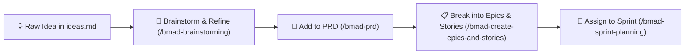

# Feature Ideas & Parking Lot — MenuCast (miniKast)

**Document Status**: `Living Backlog`  
**Purpose**: Centralized parking lot to capture raw ideas, UX enhancements, feature requests, and architectural improvements for future review and backlog grooming.  
**Cross-References**: [`docs/prd.md`](file:///Users/battosai/Dev/menucast/docs/prd.md) | [`docs/epics.md`](file:///Users/battosai/Dev/menucast/docs/epics.md) | [`docs/sprint-plan.md`](file:///Users/battosai/Dev/menucast/docs/sprint-plan.md)  
**Last Updated**: 2026-08-24  

---

## 📋 How Ideas Are Triaged & Graduated



1. **Capture**: Add ideas below using the [Idea Submission Template](#-template-for-new-ideas).
2. **Review**: Revisit this list during Sprint Planning or Sprint Retrospectives.
3. **Graduate**: When an idea is approved for delivery, convert it into an Epic in [`docs/epics.md`](file:///Users/battosai/Dev/menucast/docs/epics.md) and schedule it in [`docs/sprint-plan.md`](file:///Users/battosai/Dev/menucast/docs/sprint-plan.md).

---

## 📦 Parked & Deferred Post-MVP Features

The following features have been explicitly moved to this parking lot to maintain a rapid, focused path to the commercial MVP:

### 1. Social OAuth Login (Google & GitHub)
* **Category**: Authentication & User Accounts
* **Impact**: Medium — Provides 1-click social authentication using Google and GitHub OAuth providers via NextAuth / Supabase Auth.
* **Status**: `Parked for V2.0`
* **Notes**: Streamlined Email & Password authentication provides full self-serve access for MVP without external OAuth credential dependencies.

### 2. Video Upload & Background Looping
* **Category**: Display Engine / Media Storage
* **Impact**: Medium-High — Enables restaurants to upload MP4/WebM promotional video loops, subtle steam animations on food items, or animated logo overlays on top of static menu graphics.
* **Status**: `Parked for V2.0`
* **Notes**: Requires hardware-accelerated video decoding validation on low-power Fire TV Sticks / Android TV to avoid memory accumulation or high CPU temps.

### 3. Push History & 1-Click Rollback
* **Category**: Content Management / Versioning
* **Impact**: Medium — Provides an audit trail and visual thumbnail gallery of previously pushed menus with a 1-click "Restore / Rollback" button to quickly revert to a previous menu version.
* **Status**: `Parked for V2.0`
* **Notes**: Table `menus` already records historical pushes; UI can surface a version timeline modal.

### 4. Advanced Custom Transitions
* **Category**: Display Engine / Motion Design
* **Impact**: Low-Medium — Beyond the default zero-flicker opacity crossfade, offer configurable transition styles (e.g. horizontal slide, vertical push, zoom-fade, 3D card flip).
* **Status**: `Parked for V2.0`
* **Notes**: Must ensure non-standard transitions remain hardware-accelerated via CSS transforms (`transform: translate3d`) without dropping frames.

### 5. Daypart Scheduling & Automated Playlists
* **Category**: Automation / Scheduling Engine
* **Impact**: High — Define automated time windows for specific menus (e.g., Breakfast 6:00 AM – 11:00 AM, Lunch/Dinner 11:00 AM – 10:00 PM) and configure multi-slide timed rotation carousels.
* **Status**: `Parked for V2.0`
* **Notes**: Requires local device clock sync, timezone handling, and cron/timer evaluation in the player.

### 6. Multi-Screen Fleet Management & Location Tagging
* **Category**: Fleet & Account Management
* **Impact**: High (Multi-Store Operators) — Group screens by physical venue location (e.g., "Downtown Branch") or functional zone (e.g., "Bar TVs", "Drive-Thru"), with broadcast push to multiple screens at once.
* **Status**: `Parked for V2.0`
* **Notes**: Backend schema (`screen_groups`, `tv_group_memberships`) is already designed; advanced fleet permissions and multi-store hierarchy can be layered on in V2.0.

### 7. Multi-Screen Synchronization (Video Wall Clustering)
* **Category**: Display Engine / Local Network Sync
* **Impact**: High (Specialty Venues) — Synchronize slide transitions and animations across side-by-side multi-TV video walls with sub-frame accuracy.
* **Status**: `Exploration`
* **Notes**: Requires local network time sync (PTP / NTP) or WebRTC data channels between screens on the same LAN.

### 8. Live Menu (HTML/CSS & Hybrid Text Overlays)
* **Category**: Rendering / Dashboard Quick Editor
* **Impact**: Medium-High — Figma plugin tags text layers (`#price`, `#live`), exporting background graphics as PNG while rendering text as dynamic HTML/CSS overlays that can be edited in 5 seconds from the dashboard.
* **Status**: `Parked for V2.0`
* **Notes**: Direct 2x image push fulfills 90% of restaurant needs without font-rendering discrepancies; hybrid mode can be re-introduced for real-time POS integrations.

---

## 💡 Additional Future Explorations

### 1. Point of Sale (POS) Live Price & Stock Integration
* **Category**: Integrations / Automation
* **Impact**: High — Automatically sync prices and "86'd / Sold Out" badges directly from Toast, Square, Clover, or Lightspeed.
* **Status**: `Under Review`

### 2. Multi-Location / Multi-Tenant Role-Based Access Control (RBAC)
* **Category**: Enterprise Management
* **Impact**: High (Franchisees) — Corporate designers push brand-wide templates while local store managers only edit local prices and item availability.
* **Status**: `Under Review`

### 3. AI Menu Layout & Aspect Ratio Converter
* **Category**: Figma Plugin & AI Tools
* **Impact**: Medium — 1-click conversion of a 16:9 Landscape menu design into a 9:16 Portrait design using generative layout and font scaling.
* **Status**: `Exploration`

---

## 📝 Template for New Ideas

```markdown
### [Feature / Improvement Name]
* **Category**: [e.g. Dashboard / TV Player / Figma Plugin / API / Security]
* **Impact**: [High / Medium / Low] — [Brief explanation of user value and problem solved]
* **Status**: [Draft / Under Review / Icebox]
* **Notes / Technical Thoughts**: [Implementation ideas, potential challenges, or related packages]
```
