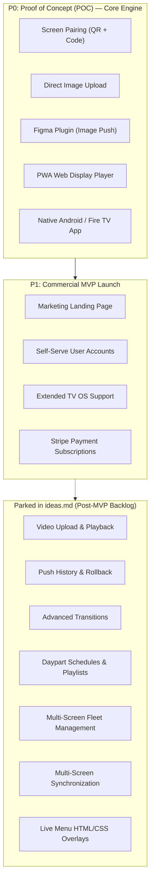

# Product Requirements Document (PRD) — MenuCast (miniKast)

**Document Status**: `Approved / In Execution`  
**Version**: `2.0.0`  
**Author**: BMad Product Management (`John`) / Lead Architect (`Winston`)  
**Target Roadmap**: **P0 (POC)** $\rightarrow$ **P1 (MVP)**  
**Cross-References**: [`docs/ideas.md`](file:///Users/battosai/Dev/menucast/docs/ideas.md) | [`docs/architecture.md`](file:///Users/battosai/Dev/menucast/docs/architecture.md) | [`docs/epics.md`](file:///Users/battosai/Dev/menucast/docs/epics.md) | [`docs/sprint-plan.md`](file:///Users/battosai/Dev/menucast/docs/sprint-plan.md)  
**Last Updated**: 2026-08-24  

---

## 1. Executive Summary & Problem Statement

### 1.1 The Problem
Digital menu boards and signage for restaurants, cafes, bars, and retail spaces are plagued by high costs and clunky workflows:
- **Clunky Legacy CMSs**: Existing signage software relies on bloated, proprietary WYSIWYG editors with rigid templates and subpar typography.
- **Friction in Designer-to-Display Workflow**: Designers create beautiful menus in Figma, export them as static images, and manually upload them via USB thumb drives or confusing web portals.
- **Expensive Hardware**: Commercial signage players (BrightSign, Scala) cost hundreds of dollars per screen with mandatory ongoing subscriptions.

### 1.2 The Solution: MenuCast (miniKast)
MenuCast bridges the gap between **Figma design workflows** and **physical TV screens**:
- **Design Native**: Designers work 100% inside Figma using their established design systems, fonts, and brand assets.
- **1-Click Screen Matching**: The Figma plugin detects target screen resolutions and orientations, generating pixel-perfect artboards with one click.
- **Instant Real-Time Push**: 1-click push from Figma updates live displays in **< 1.5 seconds** via Supabase Realtime WebSockets.
- **Budget Hardware Friendly**: Runs natively on affordable consumer hardware ($25–$40 Fire TV Sticks, Google Chromecast with Google TV, Android TV, or standard web browsers).

---

## 2. Target Personas & User Journeys

### Persona A: The Graphic & Brand Designer ("Maya")
- **Role**: Freelance or agency designer responsible for restaurant brand identity and menu boards.
- **Needs**: Native Figma integration, automatic resolution templates, instantaneous visual confirmation that the push succeeded.

### Persona B: The Restaurant Owner / General Manager ("Carlos")
- **Role**: Runs an independent coffee shop, bakery, or fast-casual venue.
- **Needs**: Simple 30-second screen pairing, reliable 24/7 uptime that never goes to sleep or shows error dialogs, affordable pricing.

---

## 3. Product Vision & Success Metrics (KPIs)

| Metric | Target | Measurement Method |
| :--- | :--- | :--- |
| **Push Latency** | $< 1.5$ seconds | Time from clicking "Push" in Figma to image render on TV |
| **Screen Onboarding Time** | $< 30$ seconds | Time to open TV app, scan QR/enter code, and pair display |
| **Playback Reliability / Uptime** | $99.9\%$ | Zero crashes, automatic reboot recovery, offline cache resilience |
| **Hardware Footprint** | $< 120$ MB RAM | Monitored inside Android WebView / Chromium container |

---

## 4. Phased Product Roadmap

---

## 5. Functional Requirements by Release Phase

### 🎯 Phase 0: Proof of Concept (POC) — Completed & Verified

The POC establishes the end-to-end technical pipeline from Figma directly to physical TV hardware.

#### FR-0.1 Screen Pairing & TV Pairing Screen (`/tv`)
- Displays launch into `/tv` and generate an 8-character human-readable pairing code alongside a dynamic QR code (`/pair?code=<CODE>`).
- Pairing completes in $< 30$ seconds over Supabase Realtime channel `pairing:<CODE>`.
- TV automatically reports its physical resolution (`screen_width`, `screen_height`), aspect ratio (`16:9`, `9:16`), and orientation (`Landscape`/`Portrait`).
- **Figma Design System Alignment (`node-id=1459-10382`)**:
  - Light mint/cyan radial glow backdrop (`#f7fcfc` to `#b7eaed`) with subtle dot pattern grid.
  - White QR code card framed with `4px solid #008996` border and `20px` border-radius.
  - miniKast bird icon perched at top-left of the QR card at `33.52deg` tilt.
  - "Screen Setup" / "Pair this Display" heading and floating white pairing code pill card (`border 1px solid #b7eaed`, `rounded-2xl`, bold `#008996` code).
  - Countdown timer ("Refreshes in MM:SS") in `#547a7c`.
  - Specification Reference: [`docs/spec-tv-pairing-ui-redesign.md`](file:///Users/battosai/Dev/menucast/docs/spec-tv-pairing-ui-redesign.md)

#### FR-0.2 Direct Image Upload
- REST API `/api/menu/upload` generates pre-signed upload URLs for Supabase Storage.
- Direct binary HTTP PUT uploads bypass serverless payload limits.
- `/api/menu/push` broadcasts `menu:push` to target `tv:<TV_ID>` channel.

#### FR-0.3 Figma Plugin (Image Only)
- Secure API Token authentication stored in `figma.clientStorage`.
- Target display selector displaying connected screens and physical specs.
- 1-click canvas frame generator creating artboards matching the TV's exact aspect ratio and dimensions.
- 1-click 2x PNG export and push with instantaneous success banner.

#### FR-0.4 Progressive Web App (PWA) & Install Experience
- Fullscreen display client with manifest and Service Worker caching.
- Double-buffered image preloading to eliminate frame tearing.
- `localStorage` device state persistence for instant recovery after power outages.
- **Install PopUp & Download Experience (`node-id=1470:9050`)**:
  - Floating card (`bg-[#f7fcfc]`, `border 1px solid #b7eaed`, `16px` border-radius).
  - miniKast bird mascot app icon (`48px` x `48px`).
  - Clear value proposition: "Install miniKast App" / "Launch directly from your device."
  - High-contrast teal `#008996` pill action button with download icon.
  - Guided iOS Safari "Add to Home Screen" visual walkthrough.
  - Specification Reference: [`docs/spec-install-app-popup.md`](file:///Users/battosai/Dev/menucast/docs/spec-install-app-popup.md)

#### FR-0.5 Native Android TV & Fire TV Kiosk Container
- Dedicated Kotlin app (`apps/tv-android`) launching on device boot (`RECEIVE_BOOT_COMPLETED`).
- 24/7 screen wake-lock (`FLAG_KEEP_SCREEN_ON`) preventing system sleep or ambient screensavers.
- Auto-reconnect watchdog with auto-retry on Wi-Fi dropouts.

---

### 🚀 Phase 1: Commercial MVP — Active Target

The MVP delivers a commercial, self-serve SaaS product ready for public customer onboarding and monetization.

#### FR-1.1 High-Converting Marketing Landing Page (`/`)
- Modern, responsive landing page showcasing the Figma $\rightarrow$ TV real-time workflow.
- Interactive hero demonstration / video walkthrough.
- Feature comparison grid against traditional signage systems.
- Pricing tiers with clear Call-to-Action (CTA) buttons directing to registration.
- FAQ section addressing hardware compatibility (Fire TV, Chromecast, Smart TVs).

#### FR-1.2 Self-Serve User Accounts & Authentication
- **Authentication Scope (MVP)**: Streamlined Email & Password authentication for registration (`/register`) and sign-in (`/login`).
- **UI & Design System Alignment**:
  - Full-screen centered card layout on mint radial gradient backdrop (`#f7fcfc` / `#b7eaed` radial tint).
  - Centered brand header with `miniKast` logo.
  - Floating card (`#FFFFFF` background, `#b7eaed` border, `16px` border-radius, soft depth shadow).
  - Responsive form controls with clear typography (`Nunito` font stack), focused input states, and accessible error/loading feedback.
  - Vibrant brand orange primary CTA (`Create Account` / `Sign In`) and subtle teal navigation links (`Back to Login` / `Create an account`).
- **Password Reset & Session Management**:
  - Secure session token persistence.
  - Password reset / recovery request handling (`/forgot-password`).
- **Data Isolation**: Multi-tenant isolation enforced with PostgreSQL Row-Level Security (RLS).

#### FR-1.3 Extended TV OS Support
- Native and packaged container distribution for major smart TV operating systems:
  - **Amazon Fire TV** (Amazon Appstore APK distribution).
  - **Google TV / Android TV** (Google Play Store distribution).
  - **Apple TV (tvOS)** (Dedicated SwiftUI / WKWebView client).
  - **Smart TV Web Browsers** (Optimized PWA launcher for LG webOS & Samsung Tizen).

#### FR-1.4 Stripe Payment Subscriptions & Billing Portal
- Tiered subscription plans (e.g. Free 1-Screen Starter, Pro Monthly/Annual per-screen tiers).
- Stripe Checkout integration for seamless plan upgrades.
- Stripe Customer Portal for managing payment methods, viewing invoices, and upgrading/canceling subscriptions.
- Automated subscription entitlement gating (enforcing screen limits per active plan).

#### FR-1.5 Dashboard & Displays Screen Management UI Redesign (`/dashboard`)
- **Figma Design System Alignment (`node-id=1468:7181`)**:
  - Light mint/cyan radial backdrop with subtle dot grid pattern (`#f7fcfc` to `#b7eaed`).
  - Standardized brand header featuring miniKast logo/wordmark, "Install App" action, secondary links ("Account", "Sign Out"), vertical separator, and dark/light theme switch.
  - Page title row with bold "Displays" heading and brand orange "Pair New Screen" primary CTA (`#f27200` / `#ff8000`).
  - Screen cards (`#FFFFFF`, `1px solid #b7eaed`, `8px` rounded corners, soft drop shadow) showing:
    - Aspect-ratio-preserving preview slot (`16:9` / `9:16`) with "Awaiting menu" placeholder or live pushed menu thumbnail.
    - Top-left status pill badge with indicator dot and elapsed time / status.
    - Bottom metadata row with screen name, trash icon button for deletion, and hardware specs (`resolution`, `aspect ratio`, `orientation`).
  - Standardized footer with copyright notice and hello@miniKast.com contact link.
- **Specification Reference**: [`docs/spec-dashboard-ui-redesign.md`](file:///Users/battosai/Dev/menucast/docs/spec-dashboard-ui-redesign.md)

---

## 6. Features Deferred to Backlog ([`docs/ideas.md`](file:///Users/battosai/Dev/menucast/docs/ideas.md))

The following items are deferred to [`docs/ideas.md`](file:///Users/battosai/Dev/menucast/docs/ideas.md) to keep the MVP laser-focused:

| Feature | Category | Reason for Deferral |
| :--- | :--- | :--- |
| **Social OAuth Login (Google / GitHub)** | Auth / Accounts | Email & Password delivers complete self-serve access without third-party OAuth app setup overhead for MVP. |
| **Video Upload** | Player / Storage | High bandwidth/storage costs; static 2x graphics satisfy 90% of core restaurant use cases. |
| **Push History & Rollback** | Versioning | Nice-to-have; single active menu graphic is sufficient for MVP. |
| **Advanced Transitions** | Display Engine | Standard double-buffered crossfade is already zero-flicker and optimal. |
| **Schedule & Dayparting** | Automation | Scheduled playlists add complexity; manual 1-click Figma push solves immediate needs. |
| **Multi-Screen Fleet Management** | Fleet Scale | Single/few screen management covers initial single-venue target customers. |
| **Multi-Screen Synchronization** | Network Sync | Frame-accurate video wall sync requires specialized local network clustering. |
| **Live Menu (HTML/CSS Overlays)** | Rendering | Direct 2x image push from Figma ensures 100% typographic fidelity without CSS emulation. |

---

## 7. Non-Functional Requirements (NFRs)

### 7.1 Performance & Latency
- **Push Latency**: Figma export $\rightarrow$ Storage Upload $\rightarrow$ Realtime Event $\rightarrow$ Display Render under $1,500$ ms.
- **Player Memory**: $< 120$ MB RAM footprint on Android TV / Fire TV hardware.

### 7.2 Security & Isolation
- **Row-Level Security (RLS)**: Strictly enforced on all PostgreSQL tables.
- **Subscription Entitlements**: Server-side validation preventing pairing beyond plan limits.
- **API Token Security**: Hex-encoded cryptographic tokens with last-used tracking.

---

## 8. Technical Architecture Alignment

- **Frontend & Marketing**: Next.js 15 App Router, React 19, TailwindCSS, Lucide Icons.
- **Auth & Billing**: NextAuth.js / Supabase Auth + Stripe Billing API & Webhooks.
- **Database & Realtime**: Supabase (PostgreSQL 15+) with Row-Level Security and Realtime WebSockets.
- **Storage**: Supabase Storage (`menus` bucket) with CDN distribution.
- **Figma Plugin**: TypeScript, Figma Plugin Manifest v2, esbuild.
- **TV Clients**: Android TV / Fire TV (Kotlin WebView container), Apple TV (tvOS), and Universal PWA.
