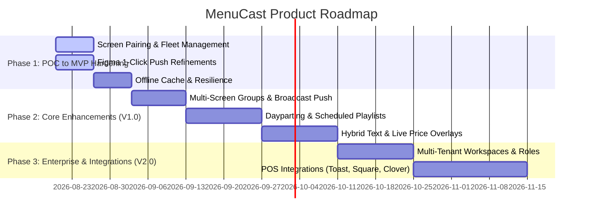

# Product Requirements Document (PRD) — MenuCast (miniKast)

**Document Status**: `Draft / Ready for Review`  
**Version**: `1.0.0`  
**Author**: BMad Product Management (`John`) / Antigravity  
**Target Delivery**: MVP $\rightarrow$ V1.0 Release  
**Last Updated**: 2026-08-19  

---

## 1. Executive Summary & Problem Statement

### 1.1 The Problem
Digital signage for restaurants, cafes, bars, and retail spaces is notoriously broken:
- **Clunky Legacy CMSs**: Existing signage software relies on bloated, proprietary WYSIWYG editors with rigid templates and ugly typography.
- **Friction in Designer-to-Display Workflow**: Designers create beautiful menus in Figma, export them as static images, email them to restaurant managers, who then manually upload them via thumb drives or complicated dashboards.
- **High Cost of Hardware**: Commercial signage players (BrightSign, Scala) cost hundreds of dollars per screen with expensive ongoing subscriptions.
- **Out-of-Date Menus & Pricing**: Changing a simple price or sold-out item takes hours or days, causing customer friction at the register.

### 1.2 The Solution: MenuCast (miniKast)
MenuCast bridges the gap between **Figma design workflows** and **physical TV screens**:
- **Design Native**: Designers work 100% inside Figma using their established design systems, fonts, and assets.
- **1-Click Screen Matching**: The Figma plugin detects target screen resolutions and orientations, generating pixel-perfect artboards with one click.
- **Instant Real-Time Push**: 1-click push from Figma updates live displays across the world in **< 1.5 seconds** via Supabase Realtime WebSockets.
- **Budget Hardware Friendly**: Runs natively on affordable consumer hardware ($25-$40 Fire TV Sticks, Google Chromecast with Google TV, Android TV, or standard web browsers).
- **Zero-Flicker Transitions**: Displays smoothly crossfade between incoming graphics using hardware-accelerated GPU opacity transitions.

---

## 2. Target Personas & User Journeys

### Persona A: The Graphic & Brand Designer ("Maya")
- **Role**: Freelance or agency designer responsible for restaurant brand identity and menu boards.
- **Pain Points**: Frustrated when menus lose their font styling, hierarchy, or layout in traditional signage tools. Hates manual multi-step export/import workflows.
- **Needs**: Native Figma integration, automatic resolution templates, instantaneous visual confirmation that the push succeeded.

### Persona B: The Restaurant Owner / General Manager ("Carlos")
- **Role**: Runs a bustling 2-location coffee shop and bakery.
- **Pain Points**: Needs to update seasonal drinks or mark sold-out pastries without waiting for the designer. Budget-conscious; doesn't want expensive enterprise hardware.
- **Needs**: Simple 30-second screen pairing, reliable 24/7 uptime that never goes to sleep or shows error dialogs, ability to tweak prices directly if needed.

### Persona C: The Multi-Location Operator ("Elena")
- **Role**: Manages 10+ franchise restaurant locations with multiple screens per store (e.g. Menu Board 1, Menu Board 2, Promo Board, Bar Specials).
- **Pain Points**: Hard to keep track of which screen has which content across multiple sites.
- **Needs**: Screen grouping by location/tag, centralized dashboard, status monitoring (online/offline), scheduled dayparting (Breakfast $\rightarrow$ Lunch $\rightarrow$ Dinner).

---

## 3. Product Vision & Success Metrics (KPIs)

| Metric | Target | Measurement Method |
| :--- | :--- | :--- |
| **Push Latency** | $< 1.5$ seconds | Time from clicking "Push" in Figma to image render on TV |
| **Screen Onboarding Time** | $< 30$ seconds | Time to unbox TV app, scan QR/enter code, and appear in dashboard |
| **Playback Reliability / Uptime** | $99.9\%$ | Zero crashes, automatic reboot recovery, offline cache resilience |
| **Transition Quality** | 60 fps / Zero flicker | Double-buffered GPU opacity crossfade, no black frames |
| **Hardware Footprint** | $< 120$ MB RAM | Monitored inside Android WebView / Chromium container |

---

## 4. Epics & Functional Requirements

### Epic 1: Screen Pairing & Fleet Management
*Enable frictionless onboarding, organizing, and monitoring of physical TV displays.*

- **FR-1.1 Pairing Handshake**:
  - Displays launch into `/tv` and generate an 8-character human-readable pairing code (e.g. `PINE-4821`) alongside a dynamic QR code.
  - User can scan QR with a mobile phone or enter code at `/pair` to pair the screen to their account in real time.
- **FR-1.2 Hardware Telemetry**:
  - TV client automatically detects and reports its physical resolution (`screen_width`, `screen_height`), aspect ratio (`16:9`, `9:16`, `4:3`, `21:9`), and orientation (`Landscape`/`Portrait`).
- **FR-1.3 Multi-Screen Grouping & Tagging**:
  - Users can assign TVs to Locations (e.g., "Downtown Store") and Groups (e.g., "Main Menu Boards", "Bar TVs").
  - Ability to push a single menu layout simultaneously to an entire screen group.
- **FR-1.4 Screen Status & Remote Diagnostics**:
  - Live heartbeat indicator (Online / Offline / Last seen).
  - Remote actions from dashboard: Clear screen, Refresh/Reload, Force re-pair.

---

### Epic 2: Figma Plugin (Designer Workstation)
*Empower designers to manage and deploy digital signage directly from Figma.*

- **FR-2.1 Authentication & Token Management**:
  - Secure authentication via 64-char API Token stored in `figma.clientStorage`.
  - Persistent server URL configuration (allowing custom domains or local staging environments).
- **FR-2.2 Target Display Inspector**:
  - Real-time dropdown list of user's paired TVs and screen groups.
  - Visual display of target TV specs (resolution, orientation, aspect ratio).
- **FR-2.3 1-Click Frame Generator**:
  - Button to instantly insert a canvas frame matching the selected TV's exact aspect ratio and resolution (e.g. 1920×1080 Landscape or 1080×1920 Portrait) with standard dark background fill.
- **FR-2.4 1-Click Export & Push**:
  - Exports selected frame as 2x PNG asset.
  - Direct upload to Supabase Storage via pre-signed URL.
  - Triggers WebSocket broadcast to target TV(s) with sub-second feedback in plugin UI.

---

### Epic 3: High-Performance TV Display Engine (`apps/web/app/tv` & `apps/tv-android`)
*Deliver a bulletproof, 24/7 commercial-grade digital signage player.*

- **FR-3.1 Native Kiosk Android / Fire TV App**:
  - Auto-start on device power-up (`RECEIVE_BOOT_COMPLETED`).
  - 24/7 screen wake-lock (`FLAG_KEEP_SCREEN_ON`) preventing screen savers or ambient sleep.
  - Auto-reconnect watchdog that polls and re-establishes connection on Wi-Fi dropouts.
  - TV Remote shortcuts (`MENU` for settings, `PLAY/PAUSE` or `R` to reload, `BACK` with confirmation modal).
- **FR-3.2 Zero-Flicker Crossfade Transition**:
  - Double-buffered image rendering. Pre-fetches incoming image in memory before triggering an 800ms hardware-accelerated cubic-bezier opacity crossfade.
- **FR-3.3 Offline Cache Resilience**:
  - Local caching via Service Worker / CacheStorage / `localStorage`. If Wi-Fi goes down or power cycles without internet, the TV continues displaying the last pushed menu.
- **FR-3.4 Web PWA & Universal Compatibility**:
  - Operates identically inside web browsers, smart TV native browsers, iPad/tablets, and Raspberry Pi digital signage kits.

---

### Epic 4: Scheduling, Dayparting & Playlists *(MVP+ / V1.0)*
*Automate time-based menu rotations without manual intervention.*

- **FR-4.1 Daypart Scheduling**:
  - Define time windows for specific menus (e.g., Breakfast 6:00 AM – 11:00 AM, Lunch/Dinner 11:00 AM – 10:00 PM).
  - Screen automatically transitions when scheduled time arrives.
- **FR-4.2 Timed Image Playlists / Rotations**:
  - Configure multi-slide playlists with custom duration per slide (e.g., rotating menu slide 1, menu slide 2, and promo slide every 15 seconds).

---

### Epic 5: Hybrid / Live Price Editing *(V1.0)*
*Enable instantaneous price and text changes without re-exporting Figma graphics.*

- **FR-5.1 Hybrid Layer Rendering**:
  - Figma plugin parses designated text layers (tagged with `#price` or `#live`) as editable fields while exporting the background graphics as a clean static PNG.
- **FR-5.2 Dashboard Quick Editor**:
  - Store managers can edit item prices or mark items as "SOLD OUT" directly from the Web Dashboard on their phone/laptop.
  - Real-time overlay updates on top of the background graphic on the TV.

---

## 5. Non-Functional Requirements (NFRs)

### 5.1 Performance & Latency
- **Push Pipeline**: Figma export $\rightarrow$ Storage Upload $\rightarrow$ Realtime Event $\rightarrow$ Display Render under $1,500$ ms on standard broadband.
- **Animation Smoothness**: Smooth 60 FPS transitions without dropped frames on low-end hardware (Quad-core ARM Cortex-A53 / 1.5GB RAM).

### 5.2 Reliability & Availability
- **24/7 Unattended Playback**: Displays must run continuously for months without memory leaks, memory accumulation, or crash loops.
- **Fault Tolerance**: Automatic fallback to cached assets if Supabase Storage or WebSocket connections experience temporary outages.

### 5.3 Security & Isolation
- **Row-Level Security (RLS)**: Strictly enforced on PostgreSQL tables (`tvs`, `menus`, `api_tokens`). Users can only query or push to their own screens.
- **API Token Authentication**: Hex-encoded cryptographic secrets with automatic revocation and last-used tracking.
- **Pairing Code Entropy**: Random pairing codes with expiration TTL (10 minutes) to prevent unauthorized screen takeover.

---

## 6. Technical Architecture Alignment

- **Frontend / Fullstack**: Next.js 15 App Router with Server Components and API route handlers.
- **State & Realtime Communication**: Supabase Realtime Channels (`pairing:<code}>` and `tv:<tv_id>`).
- **Storage**: Supabase Storage (`menus` bucket) serving assets via global CDN.
- **Figma Integration**: Figma Plugin API running manifest v2 with isolated worker sandbox and UI iframe.
- **Native TV Client**: Android 8.0+ (API 26+) Kotlin kiosk container using hardware-accelerated Android System WebView.

*(For detailed architecture diagrams and schema definitions, see [`docs/architecture.md`](file:///Users/battosai/Dev/menucast/docs/architecture.md)).*

---

## 7. Phased Implementation Roadmap

---

## 8. Open Questions & Design Decisions

1. **Multi-Screen Grouping**: Should a screen belong to multiple groups or strictly one group hierarchy (e.g., Location $\rightarrow$ Group $\rightarrow$ TV)? *(Recommended: Tags/Groups model for maximum flexibility).*
2. **Offline Fallback Storage**: Should the native Android app maintain an on-device disk cache for images in addition to Chromium WebView cache? *(Recommended: Dual-layer caching — Service Worker cache in web + SQLite/file cache in Android).*
3. **POS Integration Priority**: Which POS system should be prioritized for live price sync (Toast vs. Square vs. Clover)? *(Recommended: Square & Toast via webhook sync).*
